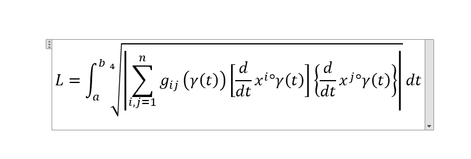

# tex2mathml

- write equation in text box
- click convert button
- click copy
- go to word and paste

$$
{a}_{n}\enspace\underrightarrow{n\rightarrow\infty} \enspace0 \enspace u. \enspace{b}_{n}\enspace\underrightarrow{n\rightarrow\infty}\enspace \infty
$$

**Pull request welcome.**
